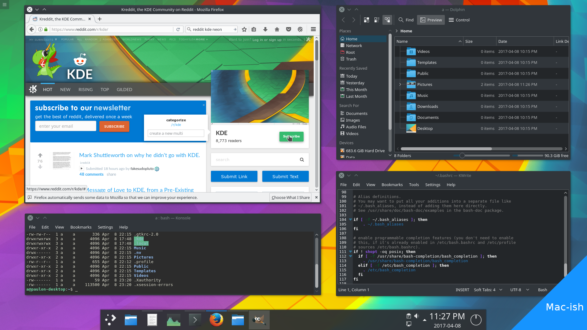
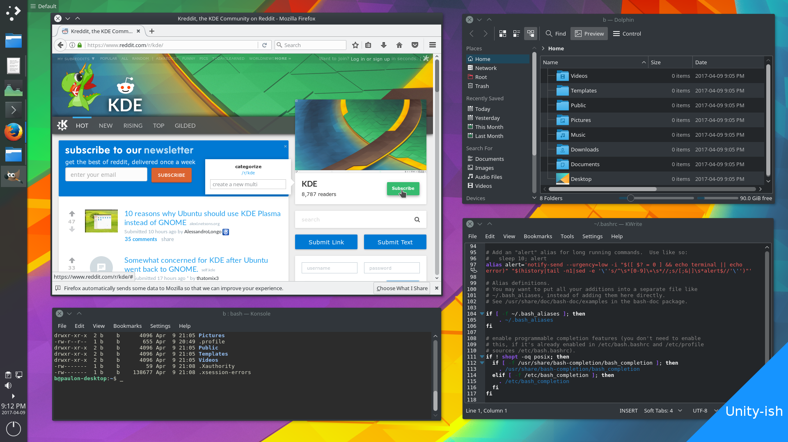
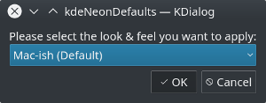

### What is this project about ?

This project is used to share initial [KDE neon](https://neon.kde.org/) settings that simplify even further some of the defaults in KDE neon. The overall goal is to provide an easy & intuitive workflow without giving up usability enhancements that take advantage of modern hardware.

It's available in two flavours:


---


### How does it work ?
Everything is done on top of [KDE neon](https://neon.kde.org/), it does not require any external dependency.


It works by providing pre-defined config files that were isolated from a fresh [KDE neon](https://neon.kde.org/) installation. It contains modifications all over KDE from little things aka not showing the icon at window's title bar to changing some of the global shortcuts (described further below).

### How do I get it ?
It requires [KDE neon](https://neon.kde.org/) 5.9 (or greater).

Get it in one-line :ok_hand::
```bash
cd $(mktemp -d) && wget https://github.com/paulondc/kdeNeonDefaults/archive/master.zip -O kdeNeonDefaults.zip && unzip kdeNeonDefaults.zip && ./kdeNeonDefaults-master/setup
```

Or get it by executing the instructions bellow:

[Download the zip](https://github.com/paulondc/kdeNeonDefaults/archive/master.zip) (or git clone the project):
unzip the contents and run the setup:

```bash
wget https://github.com/paulondc/kdeNeonDefaults/archive/master.zip -O kdeNeonDefaults.zip
unzip kdeNeonDefaults.zip
cd kdeNeonDefaults-master
./setup
```

> Be aware by running the setup it will override your current settings (you may want to create a backup of your current configuration for the directories  `~/.config, ~/.kde and ~/.local` beforehand).

***Dialogue displayed during the setup***



---

#### Customized shortcuts:
- open dolphin:  `super + e`
- open konsole: `super + r`
- minimize/restore all windows: `super + d`
- close current window: `ctrl + w`
- change to next virtual desktop: `alt + left`
- change to previous virtual desktop: `alt + right`

For the next set of shortcuts I recommend you to put a [sticker on F8 key](./data/f8-sticker.png):


- present all windows (expose): `F8`
- show desktop grid (spaces): `ctrl + F8`
- show desktop: `shift + F8`

#### Fine integrated/customized applications:
- kwrite
- dolphin
- konsole
- kdiff3
- konversation

### Licensing
kdeNeonDefaults is free software; you can redistribute it and/or modify it under the terms of the MIT License
